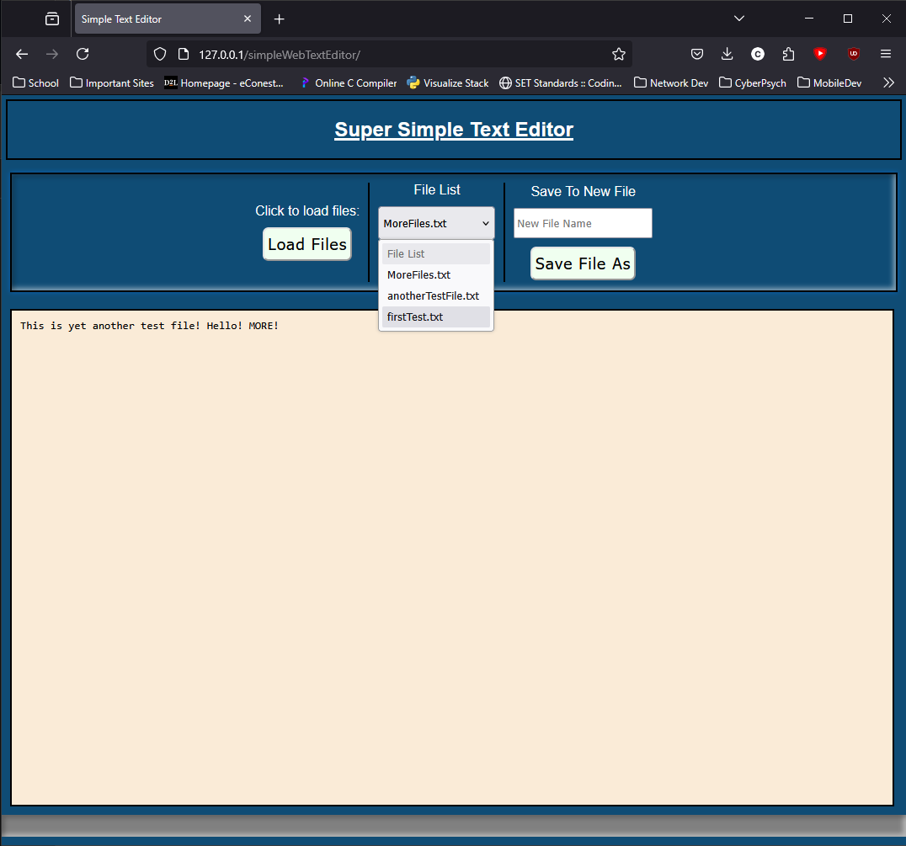

# A Simple Web Based Text Editor

This is a simple web based text editor that will read files from the *MyFiles* directory and will allow a user to edit, save and save as a new file in that directory.

It makes use of JQuery, Ajax and PHP for its functionality.

